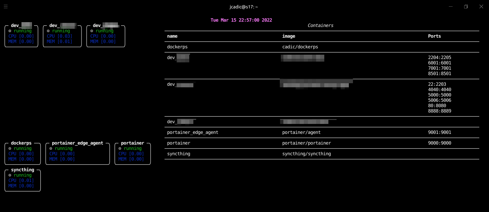

<h1 align="center">
  <br>
  <a href="https://drive.google.com/uc?id=1UKLP8d_7xxTOqV2XFzWXjPcssQnkV6AT"></a>
  <br>
  <br>
</h1>

<p align="center">
  <a href="#code-structure">Code</a> •
  <a href="#how-to-use">How To Use</a> •
  <a href="#docker">Docker</a> •
  <a href="#PythonEnv">PythonEnv</a> •

[comment]: <> (  <a href="#notebook">Notebook </a> •)
</p>



### Code structure
```python
from importlib.metadata import entry_points
from setuptools import setup
from dockerich import __version__

setup(
    name="dockerich",
    version=__version__,
    short_description="dockerich",
    long_description="dockerich",
    packages=[
        "dockerich",
    ],
    include_package_data=True,
    package_data={'': ['*.yml']},
    entry_points={
        "console_scripts":[
            "dockerich=dockerich:__main__"
            ]
    },
    url='https://github.com/JeanMaximilienCadic/dockerich.git',
    license='MIT',
    author='CADIC Jean-Maximilien',
    python_requires='>=3.6',
    install_requires=[r.rsplit()[0] for r in open("requirements.txt")],
    author_email='contact@cadic.jp',
    description='dockerich',
    platforms="linux_debian_10_x86_64",
    classifiers=[
        "Programming Language :: Python :: 3",
        "License :: OSI Approved :: MIT License",
    ]
)

```

### How to use
To clone and run this application, you'll need [Git](https://git-scm.com) and [ https://docs.docker.com/docker-for-mac/install/]( https://docs.docker.com/docker-for-mac/install/) and Python installed on your computer. 
From your command line:

Install the wheel:
```bash
# Clone this repository and install the code
git clone https://github.com/JeanMaximilienCadic/dockerich.git

# Go into the repository
cd dockerich
```


### PythonEnv
```
pip install dist/*.whl
``` 

### Docker
```shell
cd scripts && ./compile
```

### To test
```
dockerich
```
